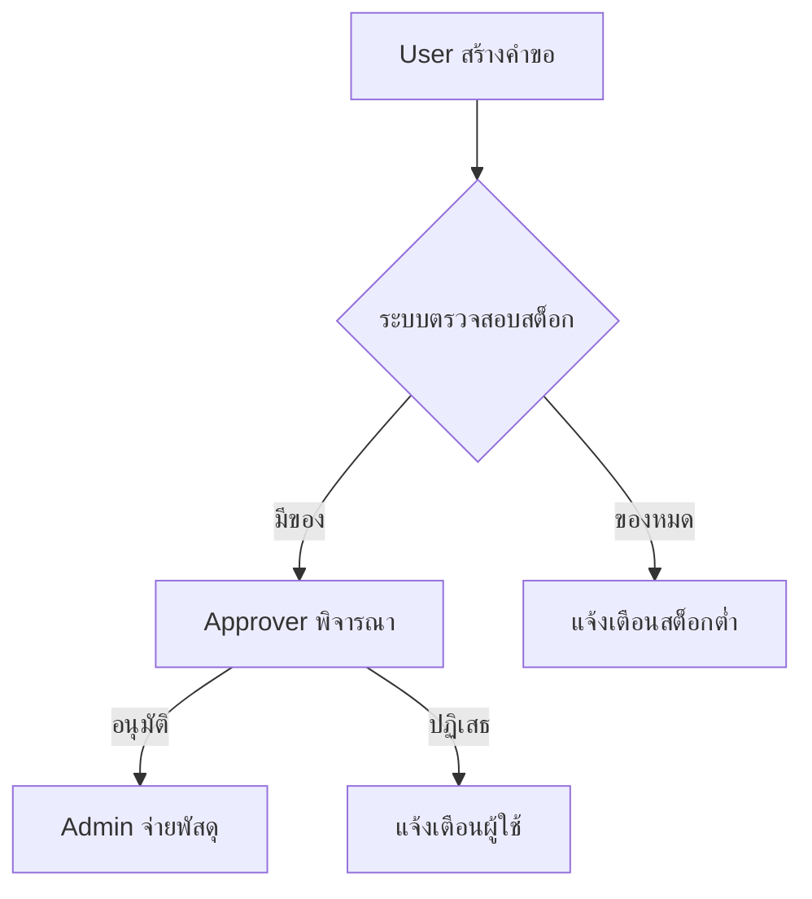

# การจัดทำคู่มือและเอกสารระบบ (System Documentation & User Manuals)

คู่มือนี้ให้แนวทางในการสร้างเอกสารประกอบระบบ HR-IMS เพื่อให้ผู้ใช้งานทุกระดับและทีมพัฒนาเข้าใจการทำงานของระบบอย่างครบถ้วน

## 📑 ประเภทของเอกสาร

การพัฒนาและส่งมอบระบบควรมีเอกสาร 3 ประเภทหลัก:

1. **User Manual (คู่มือผู้ใช้):** เน้นการใช้งานฟังก์ชันต่างๆ ตามบทบาท (Roles)
2. **Technical Documentation (เอกสารทางเทคนิค):** สำหรับทีมพัฒนาเพื่อการดูแลรักษา (Architecture, Flow, DB Schema)
3. **Deployment/Operation Guide:** ขั้นตอนการติดตั้งและการดูแลเซิร์ฟเวอร์

---

## 👥 1. การแบ่งเนื้อหาตามบทบาทผู้ใช้งาน (Role-based Documentation)

เอกสารควรแยกส่วนตามระดับสิทธิ์ เพื่อไม่ให้ผู้ใช้งานทั่วไปสับสนกับฟังก์ชันของผู้ดูแลระบบ

### สำหรับผู้ใช้งานทั่วไป (User)
- การเข้าสู่ระบบ (Login/Logout)
- การค้นหาพัสดุ (Search/Filter Inventory)
- การใช้งานตะกร้า (Cart Management)
- การส่งคำขอยืม-เบิก (Submit Request)
- การดูพัสดุที่ถือครอง (My Assets)

### สำหรับผู้อนุมัติ (Approver)
- การตรวจสอบคำขอ (Reviewing Requests)
- การอนุมัติหรือปฏิเสธพร้อมระบุเหตุผล (Approve/Reject Logic)

### สำหรับผู้ดูแลระบบ (Admin/Superadmin)
- การจัดการผู้ใช้งานและสิทธิ์ (User & RBAC Management)
- การจัดการคลังสินค้า (Warehouse & Inventory Settings)
- การตรวจสอบ Log การใช้งาน (Audit Logs)
- การพิมพ์ QR Code/Tags

---

## 🛠️ 2. มาตรฐานการเขียนเอกสาร (Standard Formatting)

### ใช้ภาษาที่เป็นมาตรฐาน
- ใช้ภาษาไทยที่ชัดเจน เป็นทางการแต่เข้าใจง่าย
- ใช้คำทับศัพท์ภาษาอังกฤษในส่วนที่เป็นชื่อปุ่มหรือฟังก์ชัน เช่น "Inventory", "Dashboard" เพื่อให้ตรงกับหน้าจอจริง

### การใช้ภาพประกอบ
- **Screenshots:** ควรมีรูปภาพประกอบขั้นตอนสำคัญ โดยไฮไลท์ส่วนที่ต้องคลิก
- **Diagrams:** ใช้ Mermaid.js เพื่อแสดง Workflow หรือ ER Diagram

---

## 🏗️ 3. โครงสร้างคู่มือผู้ใช้งาน (User Manual Structure)

1. **ปกและสารบัญ:** แสดงหัวข้อและเลขหน้าชัดเจน
2. **บทนำ:** วัตถุประสงค์ของระบบ
3. **การเริ่มต้นใช้งาน:** ความต้องการของระบบ (Browser, Internet) และการ Login
4. **เนื้อหาแยกตามโมดูล:**
    - คลังสินค้า (Inventory)
    - คำขอ (Requests)
    - งานบำรุงรักษา (Maintenance)
    - รายงาน (Reports)
5. **คำถามที่พบบ่อย (FAQ):** รวบรวมปัญหาที่ผู้ใช้อาจเจอ
6. **ช่องทางติดต่อ:** กรณีระบบมีปัญหา

---

## 💡 แนวปฏิบัติที่ดีในการทำคู่มือ (Best Practices)

1. **Update เสมอ:** ทุกครั้งที่เพิ่มฟังก์ชันใหม่ ต้องปรับปรุงคู่มือตามทันที
2. **เน้น Step-by-Step:** เขียนเป็นข้อๆ (1, 2, 3...) แทนการเขียนเป็นพรรณนา
3. **ใช้คำเตือน/ข้อควรระวัง:** ใช้สัญลักษณ์ เช่น ⚠️ หรือ 💡 เพื่อเน้นจุดสำคัญ
4. **ทำสารบัญดิจิทัล:** หากเป็นไฟล์ PDF หรือ Markdown ควรคลิกที่หัวข้อเพื่อลิงก์ไปยังเนื้อหาได้

---

## 📦 เครื่องมือแนะนำ (Recommended Tools)

- **Markdown:** สำหรับเอกสารที่ใช้ในโปรเจค
- **Canva/Word:** สำหรับคู่มือเล่มสวยงาม (PDF)
- **Snagit/Lightshot:** สำหรับแคปหน้าจอและวาดลูกศร
- **Mermaid.js:** สำหรับสร้าง Flowchart ใน Markdown
