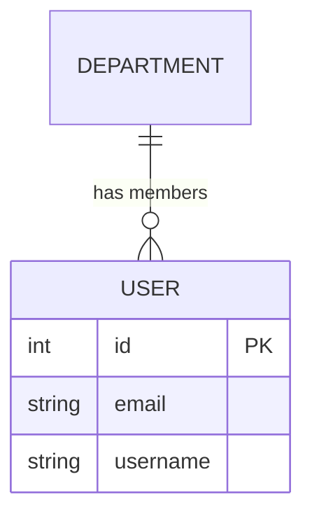
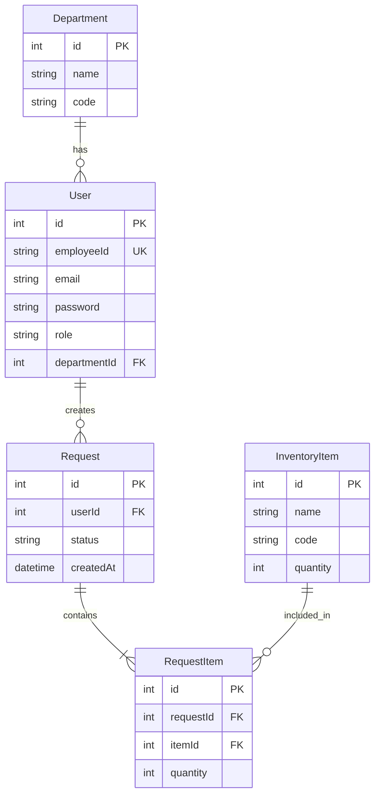
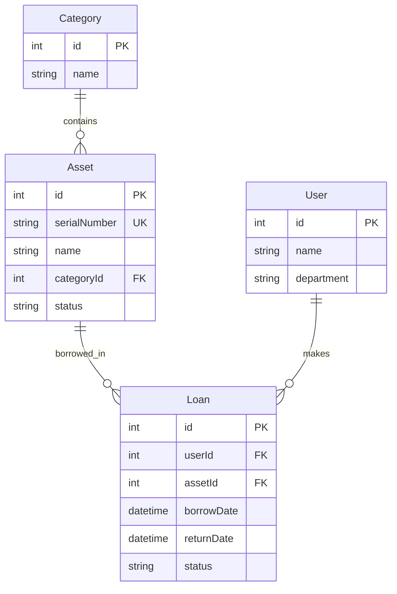

# 📊 Database Design & ER Diagram

คู่มือการออกแบบฐานข้อมูลเชิงสัมพันธ์ (Relational Database) และการเขียน Entity-Relationship Diagram (ER Diagram) สำหรับโปรเจค HR-IMS

## 1. หลักการออกแบบฐานข้อมูล (Normalization)

การออกแบบที่ดีช่วยลดความซ้ำซ้อน (Redundancy) และรักษาความถูกต้องของข้อมูล (Data Integrity) โดยใช้หลักการ Normalization

### 1.1 1NF (First Normal Form)
- **กฎ**: ข้อมูลในแต่ละช่องตาราง (Column) ต้องเป็นค่าเดียว (Atomic) ไม่มีการเก็บ List หรือ Array
- **❌ ผิด**: ตาราง Users เก็บ `Education: "B.Sc, M.Sc"`
- **✅ ถูก**: แยกตาราง `UserEducations` เก็บทีละรายการ

### 1.2 2NF (Second Normal Form)
- **กฎ**: ต้องผ่าน 1NF และทุก Non-key attribute ต้องขึ้นอยู่กับ Primary Key ทั้งหมด (กำจัด Partial Dependency)
- **สำคัญสำหรับ**: ตารางที่มี Composite Key

### 1.3 3NF (Third Normal Form)
- **กฎ**: ต้องผ่าน 2NF และไม่มี Transitive Dependency (A -> B -> C)
- **ตัวอย่าง**: ตาราง User ไม่ควรเก็บ `DepartmentName` ถ้ามี `DepartmentId` อยู่แล้ว
- **✅ ถูก**: เก็บ `DepartmentId` ใน User และแยกตาราง `Department` เก็บ `Name`

---

## 2. ความสัมพันธ์ (Relationships)

### 2.1 One-to-One (1:1)
- หนึ่งรายการในตาราง A ตรงกับหนึ่งรายการในตาราง B
- **ตัวอย่าง**: User 1 คน มี Profile 1 อัน
- **การออกแบบ**: เก็บ FK ไว้ฝั่งใดฝั่งหนึ่ง หรือใช้ PK ร่วมกัน

### 2.2 One-to-Many (1:N)
- หนึ่งรายการในตาราง A ตรงกับหลายรายการในตาราง B
- **ตัวอย่าง**: Department 1 แผนก มี User หลายคน
- **การออกแบบ**: เก็บ `DepartmentId` (FK) ไว้ที่ตาราง **User** (ฝั่ง Many)

### 2.3 Many-to-Many (M:N)
- **ตัวอย่าง**: Student ลงทะเบียนหลาย Course, Course มี Student หลายคน
- **การออกแบบ**: ต้องมี **Junction Table** (ตารางกลาง) เช่น `Enrollment`
- **HR-IMS ตัวอย่าง**: `User` <-> `Role` (ถ้า 1 คนมีหลาย Role)

---

## 3. การเขียน ER Diagram ด้วย Mermaid

Mermaid เป็นเครื่องมือ Text-to-Diagram ที่รองรับใน GitHub และ Markdown

### 3.1 Syntax พื้นฐาน

### 3.2 ตัวอย่าง HR-IMS ER Diagram

---

## 4. Best Practices ในการออกแบบ

1.  **Naming Convention**:
    *   **Table**: PascalCase หรือ snake_case (Prisma ใช้ camelCase/PascalCase ตาม Model)
    *   **Column**: camelCase
    *   **PK**: `id`
    *   **FK**: `[tableName]Id` (เช่น `departmentId`)

2.  **Audit Fields**: ควรมีเสมอในทุกตารางหลัก
    *   `createdAt`: DateTime
    *   `updatedAt`: DateTime
    *   `deletedAt`: DateTime (สำหรับ Soft Delete)
    *   `createdBy`: Int (User ID)
    *   `updatedBy`: Int (User ID)

3.  **Indexing**:
    *   สร้าง Index ที่ Column ที่ใช้ `WHERE`, `JOIN`, `ORDER BY` บ่อยๆ
    *   Unique Index สำหรับข้อมูลที่ห้ามซ้ำ (Email, CitizenID)

4.  **Security**:
    *   อย่าเก็บ Sensitive Data (Password) เป็น Plain Text -> ใช้ Hash (Bcrypt/Argon2)
    *   ข้อมูลส่วนบุคคล (PDPA) ควรมีการเข้ารหัส (Encryption) ถ้าจำเป็น

---

## 5. เครื่องมือแนะนำ (Tools)

1.  **Mermaid Live Editor**: [mermaid.live](https://mermaid.live/)
    *   เขียน ER Diagram ด้วย Code สะดวก รวดเร็ว
    *   Export เป็น SVG/PNG ได้

2.  **dbdiagram.io**: [dbdiagram.io](https://dbdiagram.io/)
    *   UI สวยงาม ใช้ง่าย
    *   Generate SQL ได้

3.  **Prisma ERD Generator**:
    *   Generate ER Diagram จาก `schema.prisma` อัตโนมัติ
    *   `npm install prisma-erd-generator`

4.  **DBeaver / MySQL Workbench**:
    *   Reverse Engineer จาก Database จริงออกมาเป็น Diagram

---

## 6. แบบฝึกหัด (Workshop)

**โจทย์**: ออกแบบฐานข้อมูลสำหรับระบบ "การยืม-คืนอุปกรณ์ IT"

**Entities ที่ต้องมี**:
1.  **User**: ผู้ใช้งาน
2.  **Asset**: อุปกรณ์ (Notebook, Mouse)
3.  **Loan**: การยืม
4.  **Category**: หมวดหมู่อุปกรณ์

**ความสัมพันธ์**:
*   Asset 1 ชิ้น อยู่ใน 1 Category
*   User 1 คน ยืม (Loan) ได้หลายครั้ง
*   Loan 1 ครั้ง ยืม Asset ได้ 1 ชิ้น (แบบง่าย) หรือหลายชิ้น (แบบซับซ้อน)

### เฉลย (แบบง่าย)

