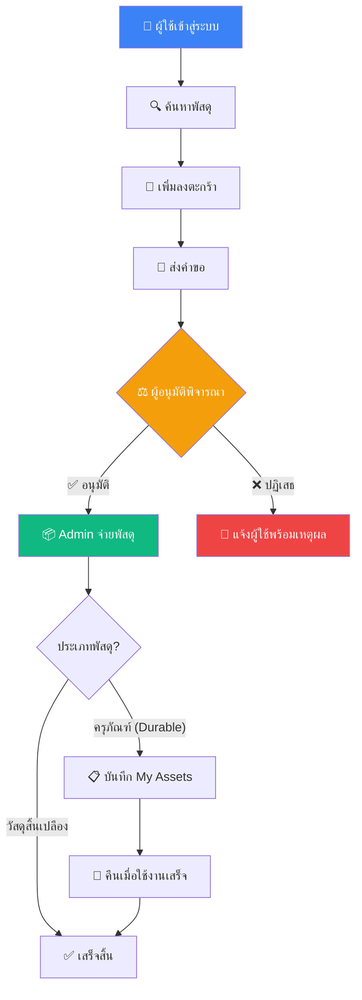
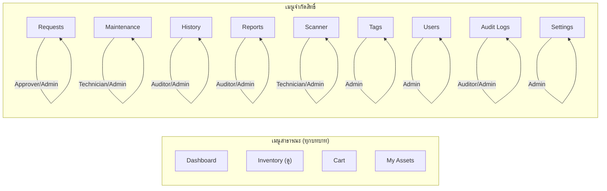

# 📘 คู่มือการใช้งานระบบ HR-IMS ฉบับสมบูรณ์
# Human Resource & Inventory Management System

> **เวอร์ชัน:** 1.3.0 | **ปรับปรุงล่าสุด:** กุมภาพันธ์ 2569  
> **จัดทำโดย:** ทีมพัฒนาระบบ HR-IMS

---

## 📑 สารบัญ (Table of Contents)

1. [บทนำและภาพรวมระบบ](#-1-บทนำและภาพรวมระบบ)
2. [ความต้องการของระบบ](#-2-ความต้องการของระบบ)
3. [บทบาทผู้ใช้งานและสิทธิ์](#-3-บทบาทผู้ใช้งานและสิทธิ์)
4. [การเข้าสู่ระบบ (Login)](#-4-การเข้าสู่ระบบ-login)
5. [หน้าหลัก Dashboard](#-5-หน้าหลัก-dashboard)
6. [การจัดการพัสดุ (Inventory)](#-6-การจัดการพัสดุ-inventory)
7. [ตะกร้าสินค้า (Cart)](#-7-ตะกร้าสินค้า-cart)
8. [ทรัพย์สินที่ถือครอง (My Assets)](#-8-ทรัพย์สินที่ถือครอง-my-assets)
9. [การจัดการคำขอ (Requests)](#-9-การจัดการคำขอ-requests)
10. [งานบำรุงรักษา (Maintenance)](#-10-งานบำรุงรักษา-maintenance)
11. [ประวัติการทำรายการ (History)](#-11-ประวัติการทำรายการ-history)
12. [รายงาน (Reports)](#-12-รายงาน-reports)
13. [เครื่องสแกน (Scanner)](#-13-เครื่องสแกน-scanner)
14. [แท็กและ QR Code (Tags)](#-14-แท็กและ-qr-code-tags)
15. [การจัดการผู้ใช้งาน (Users)](#-15-การจัดการผู้ใช้งาน-users)
16. [บันทึกตรวจสอบ (Audit Logs)](#-16-บันทึกตรวจสอบ-audit-logs)
17. [การตั้งค่าระบบ (Settings)](#-17-การตั้งค่าระบบ-settings)
18. [ระบบแจ้งเตือน (Notifications)](#-18-ระบบแจ้งเตือน-notifications)
19. [คำถามที่พบบ่อย (FAQ)](#-19-คำถามที่พบบ่อย-faq)
20. [ช่องทางติดต่อและขอความช่วยเหลือ](#-20-ช่องทางติดต่อและขอความช่วยเหลือ)

---

## 🌟 1. บทนำและภาพรวมระบบ

### ระบบ HR-IMS คืออะไร?

**HR-IMS (Human Resource & Inventory Management System)** คือระบบบริหารจัดการทรัพยากรบุคคลและพัสดุครบวงจร ที่ถูกพัฒนาขึ้นเพื่อแก้ปัญหาการจัดการทรัพย์สินและพัสดุในองค์กร โดยบูรณาการการทำงานร่วมกับฝ่ายทรัพยากรบุคคล (HR) เพื่อให้การเบิกจ่ายพัสดุมีความรัดกุม ตรวจสอบได้ และลดความผิดพลาด

### วัตถุประสงค์หลัก

| เป้าหมาย | รายละเอียด |
| :--- | :--- |
| 📦 **จัดการพัสดุครบวงจร** | รองรับทั้งครุภัณฑ์ถาวร (Durable) และวัสดุสิ้นเปลือง (Consumable) |
| 🛒 **ระบบเบิก-ยืมอัจฉริยะ** | ใช้ระบบตะกร้าสินค้า (Cart) เหมือนการช้อปปิ้งออนไลน์ |
| ✅ **Workflow อนุมัติ** | ระบบอนุมัติหลายขั้นตอนที่โปร่งใสและตรวจสอบได้ |
| 📊 **รายงานและสถิติ** | Dashboard แสดงภาพรวม กราฟ และรายงานที่ส่งออกได้ |
| 🔐 **ความปลอดภัยสูง** | ระบบสิทธิ์แบบ Multi-Role พร้อม Audit Logs ครบถ้วน |
| 📱 **รองรับมือถือ** | สแกน QR Code ผ่านกล้องมือถือและ Responsive Design |

### แผนภาพ Workflow หลักของระบบ



---

## 💻 2. ความต้องการของระบบ

### สำหรับผู้ใช้งาน (End User)

| รายการ | ข้อกำหนดขั้นต่ำ | แนะนำ |
| :--- | :--- | :--- |
| **เว็บเบราว์เซอร์** | Chrome 90+, Firefox 88+, Edge 90+ | Chrome เวอร์ชันล่าสุด |
| **ความเร็วอินเทอร์เน็ต** | 1 Mbps | 5 Mbps ขึ้นไป |
| **ขนาดหน้าจอ** | 320px (มือถือ) | 1280px (คอมพิวเตอร์) |
| **กล้อง** | ไม่จำเป็น | มี (สำหรับสแกน QR Code) |

> [!TIP]
> ระบบรองรับ **Responsive Design** สามารถใช้งานผ่านมือถือ แท็บเล็ต และคอมพิวเตอร์ได้ทุกขนาดหน้าจอ

---

## 👥 3. บทบาทผู้ใช้งานและสิทธิ์

ระบบ HR-IMS แบ่งบทบาทผู้ใช้งานออกเป็น **6 ระดับ** โดยผู้ใช้ 1 คนสามารถมีได้หลายบทบาทพร้อมกัน (Multi-Role):

| บทบาท | ไอคอน | คำอธิบาย | เมนูที่เข้าถึงได้ |
| :--- | :---: | :--- | :--- |
| **Superadmin** | 👑 | ผู้ดูแลระบบสูงสุด | เข้าถึงได้ทุกเมนูในระบบ |
| **Admin** | 🛡️ | ผู้ดูแลระบบทั่วไป | Inventory, Requests, Maintenance, History, Reports, Scanner, Tags, Users, Settings |
| **Approver** | ⚖️ | ผู้อนุมัติคำขอ | Requests (อนุมัติ/ปฏิเสธ) |
| **Auditor** | 🔍 | ผู้ตรวจสอบ | History, Reports, Audit Logs (ดูได้อย่างเดียว) |
| **Technician** | 🔧 | ช่างเทคนิค | Maintenance, Scanner |
| **User** | 👤 | ผู้ใช้งานทั่วไป | Dashboard, Inventory (ดู), Cart, My Assets |

### แผนภาพสิทธิ์การเข้าถึง



> [!IMPORTANT]
> **Superadmin** สามารถเข้าถึงได้ทุกเมนูโดยไม่มีข้อจำกัด รวมถึงเมนูตั้งค่าระบบขั้นสูง

---

## 🔑 4. การเข้าสู่ระบบ (Login)

### ขั้นตอนการเข้าสู่ระบบ

1. เปิดเว็บเบราว์เซอร์และเข้าไปที่ **URL ของระบบ** ที่ได้รับจากผู้ดูแลระบบ
2. ระบบจะแสดง **หน้า Login** ให้กรอกข้อมูลดังนี้:
   - **Email:** อีเมลที่ได้รับจากผู้ดูแลระบบ
   - **Password:** รหัสผ่านที่ได้รับ
3. คลิกปุ่ม **"Sign In"** เพื่อเข้าสู่ระบบ
4. หากข้อมูลถูกต้อง ระบบจะนำไปยังหน้า **Dashboard** อัตโนมัติ

### กรณีลืมรหัสผ่าน

1. คลิกลิงก์ **"Forgot Password"** ที่หน้า Login
2. กรอก **Email** ที่ลงทะเบียนไว้
3. ระบบจะส่งลิงก์รีเซ็ตรหัสผ่านไปยังอีเมลของคุณ
4. คลิกลิงก์ในอีเมล และตั้งรหัสผ่านใหม่

### การออกจากระบบ (Logout)

- คลิกปุ่ม **"Sign Out"** ที่ด้านล่างของแถบเมนูด้านซ้าย (Sidebar)

> [!CAUTION]
> ⚠️ **ต้องออกจากระบบทุกครั้ง** เมื่อใช้งานบนคอมพิวเตอร์สาธารณะ เพื่อป้องกันการเข้าถึงข้อมูลโดยไม่ได้รับอนุญาต

---

## 🏠 5. หน้าหลัก Dashboard

เมื่อเข้าสู่ระบบสำเร็จ ผู้ใช้จะเห็นหน้า Dashboard ที่แสดงข้อมูลสรุปภาพรวมของระบบ

### องค์ประกอบหลักของ Dashboard

| องค์ประกอบ | รายละเอียด |
| :--- | :--- |
| **📦 Total Items** | จำนวนพัสดุทั้งหมดในระบบ |
| **⚠️ Low Stock Alerts** | จำนวนพัสดุที่มีปริมาณต่ำกว่าเกณฑ์ขั้นต่ำ |
| **📝 Pending Requests** | จำนวนคำขอที่รอดำเนินการ |
| **📊 Recent Activity** | กิจกรรมล่าสุดในระบบ |

### โครงสร้างหน้าจอ

```
┌──────────────────────────────────────────────────────┐
│  Sidebar (เมนู)  │          Header Bar               │
│                   │  ┌─────────┬─────────┐            │
│  📊 Dashboard     │  │ Search  │ 🔔 User │            │
│  📦 Inventory  ▼  │  └─────────┴─────────┘            │
│    ├ All Items     │  ┌───────┬───────┬───────┬──────┐ │
│    ├ Borrow        │  │ Card1 │ Card2 │ Card3 │Card4 │ │
│    └ Withdraw      │  └───────┴───────┴───────┴──────┘ │
│  🛒 Cart           │                                   │
│  📋 My Assets      │    ┌──────────────────────────┐   │
│  📝 Requests       │    │     Charts / Tables       │   │
│  🔧 Maintenance    │    │                           │   │
│  📜 History        │    └──────────────────────────┘   │
│  📊 Reports        │                                   │
│  📷 Scanner        │         Footer                    │
│  🏷️ Tags           │                                   │
│  👥 Users          │                                   │
│  📋 Audit Logs     │                                   │
│  ⚙️ Settings    ▼  │                                   │
│                    │                                   │
│  🚪 Sign Out       │                                   │
└──────────────────────────────────────────────────────┘
```

---

## 📦 6. การจัดการพัสดุ (Inventory)

### 6.1 การดูรายการพัสดุ (All Items)

ผู้ใช้ **ทุกบทบาท** สามารถเข้าดูรายการพัสดุได้

1. คลิกเมนู **Inventory** > **All Items** ที่แถบด้านซ้าย
2. ระบบจะแสดงตารางพัสดุทั้งหมด ประกอบด้วย:
   - **ชื่อพัสดุ** (Name)
   - **หมวดหมู่** (Category)
   - **ประเภท** (Type: Durable/Consumable)
   - **Serial Number** (ถ้ามี)
   - **จำนวนคงเหลือ** (Stock)
   - **สถานะ** (Status)

### 6.2 การค้นหาและกรอง

- **Search:** พิมพ์ชื่อพัสดุในช่องค้นหาด้านบน
- **Filter ตามประเภท:**
  - **Borrow (Durable):** แสดงเฉพาะครุภัณฑ์ถาวรที่ต้องส่งคืน (เช่น โน้ตบุ๊ก, จอภาพ)
  - **Withdraw (Consumable):** แสดงเฉพาะวัสดุสิ้นเปลืองที่ไม่ต้องคืน (เช่น กระดาษ, หมึกพิมพ์)
- **Filter ตามคลังสินค้า:** เลือกคลังสินค้าที่ต้องการดู
- **เปลี่ยนมุมมอง:** สลับระหว่างมุมมองตาราง (Table) และมุมมองการ์ด (Card)

### 6.3 การเพิ่มพัสดุใหม่ (เฉพาะ Admin/Superadmin)

1. คลิกปุ่ม **"Add Item"** หรือ **"+"** ที่มุมขวาบนของหน้า Inventory
2. กรอกข้อมูลพัสดุ:
   - **ชื่อพัสดุ** (Name) *— จำเป็น*
   - **หมวดหมู่** (Category) *— จำเป็น*
   - **ประเภท** (Type): เลือก Durable หรือ Consumable *— จำเป็น*
   - **Serial Number** — ไม่บังคับ (ต้องไม่ซ้ำกัน)
   - **จำนวน** (Stock) *— จำเป็น*
   - **รูปภาพ** (Image) — ไม่บังคับ
3. คลิก **"Save"** เพื่อบันทึก

### 6.4 การแก้ไขข้อมูลพัสดุ (เฉพาะ Admin/Superadmin)

1. คลิกไอคอน **ดินสอ (Edit)** หรือเมนู **Actions** ที่แถวของพัสดุที่ต้องการแก้ไข
2. แก้ไขข้อมูลตามต้องการ
3. คลิก **"Save"** เพื่อบันทึกการเปลี่ยนแปลง

### 6.5 การนำเข้าพัสดุจำนวนมาก (Import)

1. คลิกปุ่ม **"Import"** ที่หน้า Inventory
2. เตรียมไฟล์ CSV ตามรูปแบบที่กำหนด
3. อัปโหลดไฟล์และตรวจสอบข้อมูลก่อนยืนยัน

### 6.6 การรับพัสดุเข้าคลัง (Receive)

1. ไปที่ **Inventory** > **Receive**
2. เลือกพัสดุและระบุจำนวนที่รับเข้า
3. ระบุคลังสินค้าปลายทาง
4. บันทึกรายการรับเข้า

> [!NOTE]
> การเปลี่ยนแปลงจำนวนสต็อกทุกครั้งจะถูกบันทึกใน **Stock Transaction** เพื่อการตรวจสอบย้อนหลัง

---

## 🛒 7. ตะกร้าสินค้า (Cart)

ระบบตะกร้าออกแบบมาเพื่อให้ประสบการณ์การเบิกพัสดุเหมือนการช้อปปิ้งออนไลน์

### ขั้นตอนการใช้งาน

1. **เพิ่มพัสดุลงตะกร้า:**
   - เปิดหน้า **Inventory** และเลือกพัสดุที่ต้องการ
   - คลิกปุ่ม **"Add to Cart"** (ไอคอนรถเข็น 🛒)
   - สามารถเลือกหลายรายการพร้อมกันได้

2. **ตรวจสอบตะกร้า:**
   - คลิกเมนู **Cart** ที่แถบด้านซ้าย
   - ระบบจะแสดงรายการพัสดุที่เลือกไว้ พร้อมจำนวน
   - แสดงคลังสินค้าที่ผูกกับแผนกของคุณ

3. **ลบรายการ:**
   - คลิกไอคอน **ถังขยะ (🗑️)** ที่รายการที่ต้องการลบออก

4. **ส่งคำขอ:**
   - ตรวจสอบรายการให้ถูกต้องครบถ้วน
   - คลิกปุ่ม **"Submit Request"**
   - ระบบจะสร้างคำขอและส่งไปยังผู้อนุมัติโดยอัตโนมัติ

> [!TIP]
> 💡 คุณสามารถเพิ่มพัสดุจากหลายหมวดหมู่ลงตะกร้าเดียวกันได้ และส่งคำขอพร้อมกันในครั้งเดียว

---

## 📋 8. ทรัพย์สินที่ถือครอง (My Assets)

เมนูนี้แสดงรายการ **ครุภัณฑ์ (Durable)** ทั้งหมดที่ผู้ใช้กำลังยืมอยู่

### ข้อมูลที่แสดง

- **ชื่อพัสดุ** ที่ถือครอง
- **Serial Number** ของพัสดุ
- **วันที่เริ่มยืม**
- **กำหนดคืน** (Due Date)
- **สถานะ** (ปกติ / เลยกำหนด)

### การคืนพัสดุ

1. เลือกรายการที่ต้องการคืน
2. คลิกปุ่ม **"Return"**
3. ระบบจะสร้างคำขอคืนและส่งให้ Admin ยืนยันการรับคืน

> [!WARNING]
> ⚠️ หากพัสดุ **เลยกำหนดคืน** จะถูกทำเครื่องหมายเป็น **Overdue** และอาจมีการแจ้งเตือนไปยังผู้อนุมัติ

---

## 📝 9. การจัดการคำขอ (Requests)

> **สิทธิ์:** Superadmin, Admin, Approver

### 9.1 สำหรับผู้ใช้งานทั่วไป — ติดตามสถานะ

ผู้ใช้ทั่วไปสามารถดูสถานะคำขอที่ตนเองส่งไปได้:

| สถานะ | สี | ความหมาย |
| :--- | :---: | :--- |
| `Pending` | 🟡 | รอการพิจารณาจากผู้อนุมัติ |
| `Approved` | 🟢 | คำขอได้รับการอนุมัติแล้ว |
| `Rejected` | 🔴 | คำขอถูกปฏิเสธ (ดูเหตุผลได้) |
| `Returned` | 🔵 | พัสดุถูกส่งคืนแล้ว (สำหรับการยืม) |
| `Overdue` | 🟠 | เลยกำหนดส่งคืน |

### 9.2 สำหรับผู้อนุมัติ (Approver) — อนุมัติ/ปฏิเสธ

1. เข้าเมนู **Requests**
2. ระบบแสดงจำนวนคำขอที่รอดำเนินการ (Pending)
3. คลิกที่คำขอเพื่อดูรายละเอียด:
   - ชื่อผู้ขอ, แผนก
   - รายการพัสดุและจำนวน
   - วัตถุประสงค์
4. เลือกดำเนินการ:
   - ✅ **Approve:** อนุมัติคำขอ
   - ❌ **Reject:** ปฏิเสธพร้อมระบุเหตุผล

### 9.3 สำหรับ Admin — จ่ายพัสดุ

หลังจากคำขอได้รับการอนุมัติ Admin ต้องดำเนินการ:

1. ตรวจสอบรายการที่อนุมัติแล้ว
2. ยืนยันการส่งมอบพัสดุ (Checkout/Handover)
3. ระบบจะอัปเดตจำนวนสต็อกอัตโนมัติ

### 9.4 การตรวจสอบรายการเลยกำหนด (Check Overdue)

- คลิกปุ่ม **"Check Overdue"** เพื่อให้ระบบตรวจสอบรายการยืมที่เลยกำหนดคืน
- ระบบจะทำเครื่องหมาย Overdue อัตโนมัติ

---

## 🔧 10. งานบำรุงรักษา (Maintenance)

> **สิทธิ์:** Superadmin, Admin, Technician

### การใช้งาน

1. เข้าเมนู **Maintenance**
2. ดูรายการงานซ่อมบำรุงทั้งหมด
3. **การแจ้งซ่อม:**
   - ระบุพัสดุที่มีปัญหา
   - บันทึกอาการเสีย/ปัญหาที่พบ
   - กำหนดช่างเทคนิคผู้รับผิดชอบ
4. **การอัปเดตสถานะ:**
   - บันทึกความคืบหน้าการซ่อม
   - ปรับสถานะ: รอดำเนินการ → กำลังซ่อม → ซ่อมเสร็จ
   - บันทึกหมายเหตุการซ่อม (Repair Notes)

---

## 📜 11. ประวัติการทำรายการ (History)

> **สิทธิ์:** Superadmin, Admin, Auditor

### ข้อมูลที่บันทึก

- **ผู้ทำรายการ** (User)
- **ประเภทการกระทำ** (Action): ยืม, คืน, เบิก, แก้ไข
- **พัสดุที่เกี่ยวข้อง** (Item)
- **สถานะ** (Status)
- **วันที่และเวลา** (Timestamp)

---

## 📊 12. รายงาน (Reports)

> **สิทธิ์:** Superadmin, Admin, Auditor

### ประเภทรายงาน

- **สรุปสถิติภาพรวม:** จำนวนพัสดุ, การเบิกจ่าย, สต็อกคงเหลือ
- **รายงานการเบิกจ่ายตามช่วงเวลา:** กราฟแสดงแนวโน้ม
- **รายงานสต็อกต่ำ:** พัสดุที่ต่ำกว่าเกณฑ์ขั้นต่ำ
- **รายงานตามหมวดหมู่/คลังสินค้า**

### การส่งออกข้อมูล

- รองรับการส่งออกเป็น **CSV** และ **PDF**

---

## 📷 13. เครื่องสแกน (Scanner)

> **สิทธิ์:** Superadmin, Admin, Technician

### วิธีใช้งาน

1. เข้าเมนู **Scanner**
2. อนุญาตให้เว็บไซต์เข้าถึงกล้อง (Camera Permission)
3. นำกล้องไปส่องที่ **QR Code** หรือ **Barcode** บนตัวพัสดุ
4. ระบบจะแสดงข้อมูลพัสดุทันที:
   - ชื่อ, Serial Number
   - สถานะปัจจุบัน
   - ผู้ถือครอง (ถ้ามี)
   - ประวัติการใช้งาน

> [!TIP]
> 💡 สามารถใช้กล้องมือถือสแกนได้โดยเปิดเว็บไซต์ผ่าน Browser บนมือถือ

---

## 🏷️ 14. แท็กและ QR Code (Tags)

> **สิทธิ์:** Superadmin, Admin

### การสร้างและพิมพ์ QR Tags

1. เข้าเมนู **Tags**
2. เลือกรายการพัสดุที่ต้องการพิมพ์ QR Code
3. ระบบจะสร้าง QR Code ที่มีข้อมูลของพัสดุแต่ละชิ้น
4. คลิก **"Print"** เพื่อพิมพ์สติกเกอร์
5. นำสติกเกอร์ไปติดที่ตัวพัสดุจริง

### ข้อมูลใน QR Code
- ลิงก์ไปยังหน้าข้อมูลพัสดุในระบบโดยตรง
- สามารถสแกนด้วยกล้องมือถือหรือเมนู Scanner

---

## 👥 15. การจัดการผู้ใช้งาน (Users)

> **สิทธิ์:** Superadmin, Admin

### 15.1 การดูรายชื่อผู้ใช้

- แสดงข้อมูลผู้ใช้ทั้งหมด: ชื่อ, อีเมล, บทบาท, แผนก, สถานะ

### 15.2 การเพิ่มผู้ใช้ใหม่

1. คลิกปุ่ม **"Add User"**
2. กรอกข้อมูล:
   - **ชื่อ-นามสกุล** (Name)
   - **อีเมล** (Email)
   - **รหัสผ่าน** (Password)
   - **บทบาท** (Role): เลือกได้หลายบทบาท
   - **แผนก** (Department)
3. คลิก **"Save"**

### 15.3 การแก้ไขข้อมูลผู้ใช้

1. คลิกไอคอน **Edit** ที่แถวของผู้ใช้
2. แก้ไขข้อมูลตามต้องการ (เปลี่ยนบทบาท, แผนก, สถานะ)
3. บันทึกการเปลี่ยนแปลง

### 15.4 การระงับผู้ใช้

- เปลี่ยนสถานะเป็น **Inactive** แทนการลบ เพื่อรักษาประวัติข้อมูล

> [!CAUTION]
> ⚠️ **อย่าลบผู้ใช้** ที่มีประวัติการทำรายการในระบบ ควรเปลี่ยนสถานะเป็น Inactive แทน เนื่องจากการลบจะส่งผลกระทบต่อข้อมูลประวัติย้อนหลัง

---

## 📋 16. บันทึกตรวจสอบ (Audit Logs)

> **สิทธิ์:** Superadmin, Admin, Auditor

### ข้อมูลที่บันทึก

ทุกการเปลี่ยนแปลงสำคัญในระบบจะถูกบันทึกไว้ใน Audit Logs:

| ฟิลด์ | รายละเอียด |
| :--- | :--- |
| **ผู้กระทำ** | ชื่อและ ID ของผู้ใช้ที่ทำรายการ |
| **การกระทำ** | CREATE, UPDATE, DELETE |
| **เป้าหมาย** | ตาราง/ข้อมูลที่ถูกแก้ไข (Entity) |
| **รายละเอียด** | ข้อมูลก่อน-หลังการเปลี่ยนแปลง |
| **วันเวลา** | Timestamp ของเหตุการณ์ |

> [!NOTE]
> Audit Logs ใช้เพื่อความโปร่งใสและป้องกันการทุจริต ผู้ตรวจสอบ (Auditor) สามารถค้นหาย้อนหลังได้ว่าใครทำอะไร เมื่อไหร่

---

## ⚙️ 17. การตั้งค่าระบบ (Settings)

> **สิทธิ์:** Superadmin, Admin

เมนู Settings ประกอบด้วยเมนูย่อยดังนี้:

### 17.1 การตั้งค่าทั่วไป (Main Settings)

| การตั้งค่า | คำอธิบาย |
| :--- | :--- |
| **Organization Name** | ชื่อองค์กรที่แสดงในระบบ |
| **Borrow Limit** | จำนวนวันสูงสุดที่อนุญาตให้ยืม (ค่าเริ่มต้น: 7 วัน) |
| **Check Interval** | ระยะเวลาตรวจสอบ Overdue (ค่าเริ่มต้น: 7 วัน) |
| **Maintenance Alert** | เปิด/ปิดการแจ้งเตือนงานบำรุงรักษา |
| **Allow Registration** | อนุญาตให้สมัครสมาชิกเอง |
| **Footer Text** | ข้อความแสดงด้านล่างทุกหน้า |

### 17.2 เมนูตั้งค่าย่อย

| เมนู | ไอคอน | คำอธิบาย |
| :--- | :---: | :--- |
| **Categories** | 📁 | จัดการหมวดหมู่พัสดุ (เพิ่ม/แก้ไข/ลบ) |
| **Warehouses** | 📦 | จัดการคลังสินค้า (ชื่อ, รหัส, ประเภท) |
| **Dept Mapping** | 📍 | กำหนดว่าแผนกไหนเบิกจากคลังใด |
| **System Config** | ⚙️ | ตั้งค่าระบบขั้นสูง |
| **Security** | 🛡️ | ตั้งค่าความปลอดภัย |
| **Rate Limiting** | 📊 | จำกัดจำนวนคำขอต่อนาที |
| **Logging** | 📝 | ตั้งค่าระดับการบันทึก Log |
| **Backup & Restore** | 💾 | สำรองและกู้คืนข้อมูล |
| **Password Policy** | 🔒 | กำหนดนโยบายรหัสผ่าน |
| **Email Config** | 📧 | ตั้งค่า SMTP สำหรับส่งอีเมล |
| **System Health** | 💚 | ตรวจสอบสถานะระบบ |

---

## 🔔 18. ระบบแจ้งเตือน (Notifications)

### ตำแหน่ง
- ไอคอน **กระดิ่ง (🔔)** อยู่ที่ **Header Bar** มุมบนขวา

### ประเภทการแจ้งเตือน

| ประเภท | ผู้รับ | เหตุการณ์ |
| :--- | :--- | :--- |
| **Low Stock Alert** | Admin | พัสดุมีจำนวนต่ำกว่าเกณฑ์ที่กำหนด |
| **New Request** | Approver | มีคำขอใหม่รอพิจารณา |
| **Request Approved** | User | คำขอได้รับการอนุมัติ |
| **Request Rejected** | User | คำขอถูกปฏิเสธ |
| **Overdue Alert** | User/Admin | พัสดุเลยกำหนดคืน |
| **Maintenance Alert** | Technician | มีงานซ่อมใหม่ |

### การจัดการแจ้งเตือน
- คลิกไอคอนกระดิ่งเพื่อดูรายการแจ้งเตือนทั้งหมด
- แจ้งเตือนที่ยังไม่อ่านจะแสดงตัวเลขจำนวน
- คลิกที่แจ้งเตือนเพื่ออ่านและทำเครื่องหมายว่าอ่านแล้ว

---

## ❓ 19. คำถามที่พบบ่อย (FAQ)

### Q1: ฉันไม่สามารถเข้าสู่ระบบได้ ทำอย่างไร?
**A:** ตรวจสอบว่าพิมพ์ Email และ Password ถูกต้อง (ตรวจสอบ Caps Lock) หากยังไม่ได้ ให้ใช้ "Forgot Password" หรือติดต่อผู้ดูแลระบบ

### Q2: ทำไมฉันไม่เห็นบางเมนู?
**A:** เมนูจะแสดงตามบทบาท (Role) ที่ได้รับมอบหมาย หากต้องการเข้าถึงเมนูเพิ่มเติม กรุณาติดต่อผู้ดูแลระบบเพื่อขอเพิ่มบทบาท

### Q3: ฉันส่งคำขอไปแล้วแต่ยังไม่ได้รับการอนุมัติ?
**A:** คำขอจะอยู่ในสถานะ "Pending" จนกว่าผู้อนุมัติ (Approver) จะพิจารณา คุณสามารถตรวจสอบสถานะได้ที่เมนู Requests

### Q4: ฉันต้องการคืนพัสดุ ทำอย่างไร?
**A:** ไปที่เมนู **My Assets** > เลือกรายการที่ต้องการคืน > คลิก **Return** ระบบจะสร้างคำขอคืนให้อัตโนมัติ

### Q5: QR Code ที่สแกนแล้วไม่ทำงาน?
**A:** ตรวจสอบว่า QR Code ไม่เสียหาย และให้แน่ใจว่าเบราว์เซอร์ได้รับอนุญาตให้เข้าถึงกล้อง หากยังมีปัญหา ลองใช้เบราว์เซอร์ Chrome

### Q6: สามารถเบิกพัสดุทีละหลายชิ้นได้ไหม?
**A:** ได้ ใช้ระบบ **ตะกร้า (Cart)** เลือกเพิ่มพัสดุหลายชิ้นลงตะกร้า แล้วส่งคำขอพร้อมกันในครั้งเดียว

### Q7: ข้อมูลในระบบปลอดภัยหรือไม่?
**A:** ระบบใช้มาตรการรักษาความปลอดภัยหลายชั้น ได้แก่:
- รหัสผ่านเข้ารหัสด้วย **Bcrypt**
- ระบบสิทธิ์ **RBAC** (Role-Based Access Control)
- **Audit Logs** บันทึกทุกการเปลี่ยนแปลง
- **Server-side validation** ป้องกันข้อมูลไม่ถูกต้อง
- **Cloudflare Tunnel** ซ่อน IP Address เซิร์ฟเวอร์

### Q8: วิธีเปลี่ยนรหัสผ่าน?
**A:** ติดต่อผู้ดูแลระบบเพื่อรีเซ็ตรหัสผ่าน หรือใช้ฟังก์ชัน "Forgot Password" ที่หน้า Login

---

## 📞 20. ช่องทางติดต่อและขอความช่วยเหลือ

| ช่องทาง | รายละเอียด |
| :--- | :--- |
| 📧 **อีเมล** | ติดต่อผู้ดูแลระบบผ่านอีเมลองค์กร |
| 💬 **แจ้งปัญหาในระบบ** | ใช้ฟังก์ชัน Maintenance เพื่อแจ้งปัญหาพัสดุ |
| 📖 **เอกสารเพิ่มเติม** | ดูเอกสารทางเทคนิคที่โฟลเดอร์ `docs/` |

---

## 📎 ภาคผนวก

### A. ตารางสรุปเมนูตามบทบาท

| เมนู | User | Technician | Approver | Auditor | Admin | Superadmin |
| :--- | :---: | :---: | :---: | :---: | :---: | :---: |
| Dashboard | ✅ | ✅ | ✅ | ✅ | ✅ | ✅ |
| Inventory (ดู) | ✅ | ✅ | ✅ | ✅ | ✅ | ✅ |
| Cart | ✅ | ✅ | ✅ | ✅ | ✅ | ✅ |
| My Assets | ✅ | ✅ | ✅ | ✅ | ✅ | ✅ |
| Requests | ❌ | ❌ | ✅ | ❌ | ✅ | ✅ |
| Maintenance | ❌ | ✅ | ❌ | ❌ | ✅ | ✅ |
| History | ❌ | ❌ | ❌ | ✅ | ✅ | ✅ |
| Reports | ❌ | ❌ | ❌ | ✅ | ✅ | ✅ |
| Scanner | ❌ | ✅ | ❌ | ❌ | ✅ | ✅ |
| Tags | ❌ | ❌ | ❌ | ❌ | ✅ | ✅ |
| Users | ❌ | ❌ | ❌ | ❌ | ✅ | ✅ |
| Audit Logs | ❌ | ❌ | ❌ | ✅ | ✅ | ✅ |
| Settings | ❌ | ❌ | ❌ | ❌ | ✅ | ✅ |

### B. คำศัพท์ที่ใช้ในระบบ (Glossary)

| คำศัพท์ | ความหมาย |
| :--- | :--- |
| **Durable** | ครุภัณฑ์ถาวร — สิ่งของที่มีอายุการใช้งานยาวนาน ต้องส่งคืนเมื่อใช้เสร็จ |
| **Consumable** | วัสดุสิ้นเปลือง — สิ่งของที่เบิกแล้วใช้หมดไป ไม่ต้องส่งคืน |
| **Borrow** | การยืม — การขอใช้ครุภัณฑ์ถาวรชั่วคราว |
| **Withdraw** | การเบิก — การขอเบิกวัสดุสิ้นเปลือง |
| **RBAC** | Role-Based Access Control — ระบบควบคุมสิทธิ์ตามบทบาท |
| **Audit Log** | บันทึกตรวจสอบ — ประวัติการเปลี่ยนแปลงข้อมูลในระบบ |
| **Stock Level** | ระดับสต็อก — จำนวนพัสดุคงเหลือในคลัง |
| **Low Stock** | สต็อกต่ำ — พัสดุมีจำนวนน้อยกว่าเกณฑ์ขั้นต่ำที่กำหนด |
| **Overdue** | เลยกำหนด — พัสดุที่ยืมเกินระยะเวลาที่กำหนดไว้ |
| **Warehouse** | คลังสินค้า — สถานที่จัดเก็บพัสดุ |
| **QR Code** | รหัส QR — รหัสสองมิติที่ใช้อ้างอิงข้อมูลพัสดุ |

---

> 📘 *คู่มือฉบับนี้จัดทำขึ้นสำหรับระบบ HR-IMS เวอร์ชัน 1.3.0*  
> *หากมีข้อสงสัยหรือต้องการข้อมูลเพิ่มเติม กรุณาติดต่อผู้ดูแลระบบ*  
> **HR-IMS Project** • *Excellence in Resource Management*
