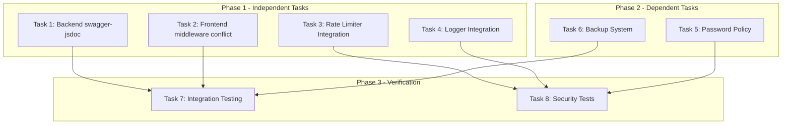

# Parallel Execution Plan - HR-IMS

**Date:** 2026-02-16
**Mode:** Parallel Agent Spawn
**Objective:** แก้ไขปัญหาค้างและปรับปรุงระบบพร้อมกันหลายงาน

---

## 📊 Task Dependency Analysis



---

## 🚀 Phase 1: Parallel Execution (4 Tasks)

### Task 1: Fix Backend Error - swagger-jsdoc

| Property | Value |
|----------|-------|
| **Priority** | 🔴 High |
| **Type** | Bug Fix |
| **Dependencies** | None |
| **Estimated Complexity** | Low |
| **Files** | `backend/package.json`, `backend/src/utils/swagger.ts` |

**Action:**
```bash
cd backend && npm install swagger-jsdoc swagger-ui-express
```

**Verification:**
```bash
cd backend && npm run dev
# Check if server starts without error
```

---

### Task 2: Fix Frontend Middleware Conflict

| Property | Value |
|----------|-------|
| **Priority** | 🔴 High |
| **Type** | Bug Fix |
| **Dependencies** | None |
| **Estimated Complexity** | Medium |
| **Files** | `frontend/next-app/middleware.ts`, `frontend/next-app/proxy.ts` |

**Analysis:**
- Next.js 16 ไม่รองรับ middleware.ts และ proxy.ts พร้อมกัน
- ต้องเลือกเก็บไฟล์เดียว

**Action:**
1. ตรวจสอบการใช้งานของแต่ละไฟล์
2. ย้าย logic ที่จำเป็นไปรวมไว้ที่เดียว
3. ลบไฟล์ที่ซ้ำซ้อน

---

### Task 3: Integrate Rate Limiter

| Property | Value |
|----------|-------|
| **Priority** | 🔴 High |
| **Type** | Feature Integration |
| **Dependencies** | None |
| **Estimated Complexity** | Medium |
| **Files** | `backend/src/index.ts`, `backend/src/middleware/rateLimiter.ts` |

**Current Status:**
- ✅ Rate limiter code exists at `backend/src/middleware/rateLimiter.ts`
- ❌ Not integrated in `backend/src/index.ts`

**Action:**
```typescript
// Add to backend/src/index.ts
import { createApiLimiter, createAuthLimiter } from './middleware/rateLimiter';

// After app.use(express.json());
app.use('/api/', await createApiLimiter());
app.use('/api/auth/login', await createAuthLimiter());
```

---

### Task 4: Integrate Logger

| Property | Value |
|----------|-------|
| **Priority** | 🔴 High |
| **Type** | Feature Integration |
| **Dependencies** | None |
| **Estimated Complexity** | Medium |
| **Files** | `backend/src/index.ts`, `backend/src/utils/logger.ts` |

**Current Status:**
- ✅ Logger code exists at `backend/src/utils/logger.ts`
- ❌ Not integrated in `backend/src/index.ts`

**Action:**
```typescript
// Add to backend/src/index.ts
import { getLogger, logError, logInfo } from './utils/logger';

// Initialize logger on startup
const logger = await getLogger();
logger.info('Server starting...');

// Add error handling
app.use(async (err, req, res, next) => {
    await logError(err.message, err);
    res.status(500).json({ error: 'Internal Server Error' });
});
```

---

## 📋 Phase 2: Sequential Tasks (2 Tasks)

### Task 5: Password Policy Enhancement

| Property | Value |
|----------|-------|
| **Priority** | 🟠 Medium |
| **Type** | Security Enhancement |
| **Dependencies** | Task 4 (Logger) |
| **Files** | `backend/src/utils/passwordPolicy.ts` |

---

### Task 6: Backup & Recovery System

| Property | Value |
|----------|-------|
| **Priority** | 🟠 Medium |
| **Type** | Feature Implementation |
| **Dependencies** | Task 4 (Logger) |
| **Files** | `backend/src/services/backupService.ts` |

---

## 🧪 Phase 3: Verification (2 Tasks)

### Task 7: Integration Testing

- Run all backend tests
- Run all frontend tests
- Manual testing of fixed features

### Task 8: Security Tests

- Run security test suite
- Verify rate limiting works
- Verify logging works

---

## 🎯 Execution Strategy

### Parallel Spawn Configuration

```
┌─────────────────────────────────────────────────────────────┐
│                    PARALLEL EXECUTION                        │
├─────────────────────────────────────────────────────────────┤
│                                                              │
│  ┌──────────┐  ┌──────────┐  ┌──────────┐  ┌──────────┐    │
│  │  Task 1  │  │  Task 2  │  │  Task 3  │  │  Task 4  │    │
│  │ Backend  │  │ Frontend │  │  Rate    │  │  Logger  │    │
│  │ swagger  │  │ middleware│  │ Limiter  │  │          │    │
│  └────┬─────┘  └────┬─────┘  └────┬─────┘  └────┬─────┘    │
│       │             │             │             │           │
│       └─────────────┴─────────────┴─────────────┘           │
│                           │                                  │
│                           ▼                                  │
│                    ┌──────────┐                             │
│                    │  Verify  │                             │
│                    │  & Test  │                             │
│                    └──────────┘                             │
└─────────────────────────────────────────────────────────────┘
```

---

## 📝 Handoff Template for Each Task

Each spawned task should use this template:

```markdown
# Task Handoff: [Task Name]

---
**From:** Architect (Kilo Code)
**To:** Code Agent
**Date:** 2026-02-16
**Priority:** High/Medium/Low
**Status:** Ready for Implementation

---

## Task Description
[Detailed description]

## Files to Modify
- `path/to/file1.ts` - [what to do]
- `path/to/file2.ts` - [what to do]

## Implementation Steps
1. Step 1
2. Step 2
3. Step 3

## Acceptance Criteria
- [ ] Criterion 1
- [ ] Criterion 2

## Commands to Run
```bash
npm run dev
npm test
```
```

---

## ⚠️ Risk Assessment

| Risk | Probability | Impact | Mitigation |
|------|-------------|--------|------------|
| Dependency conflicts | Low | Medium | Test in isolation first |
| Breaking changes | Medium | High | Create backup branch |
| Integration issues | Medium | Medium | Sequential verification |

---

*Plan created by: Architect (Kilo Code)*
*Date: 2026-02-16*
